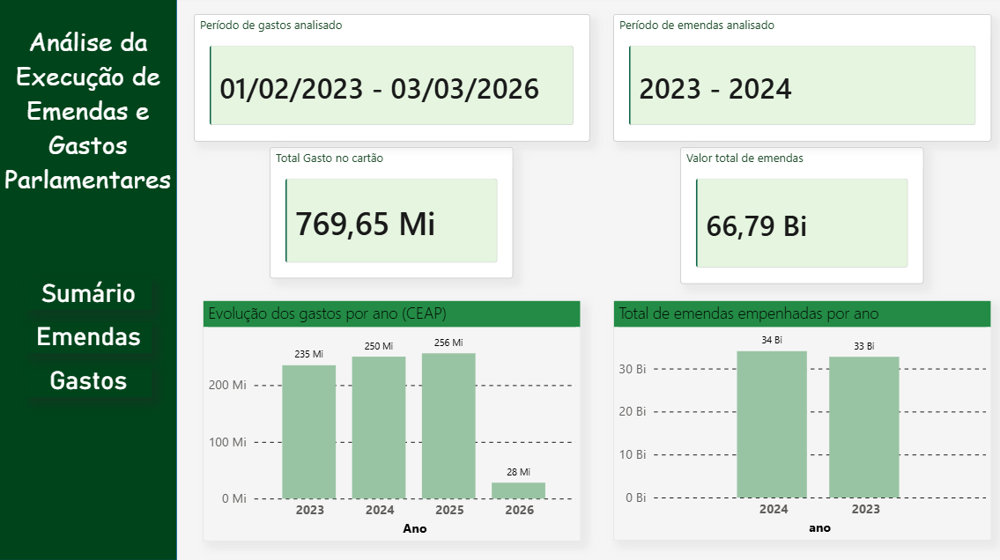
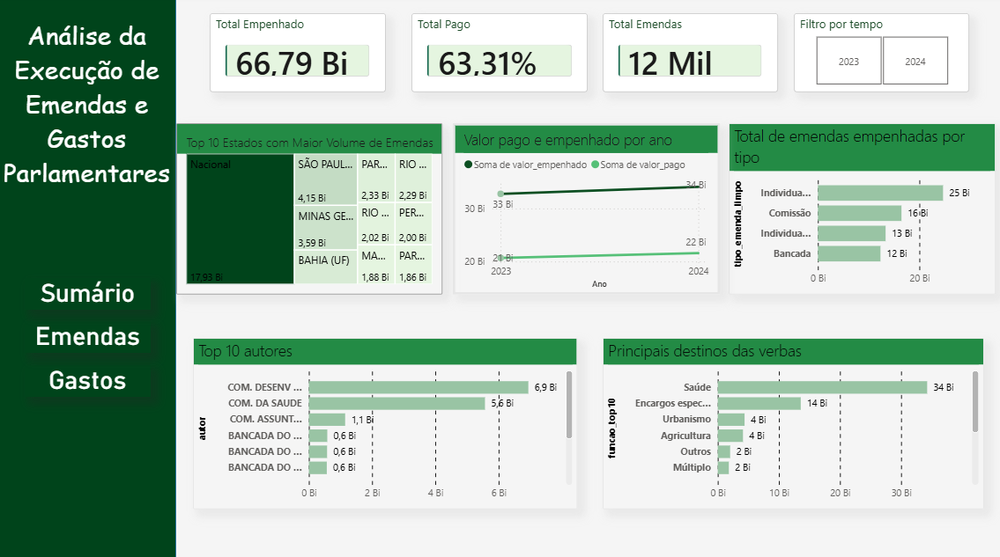
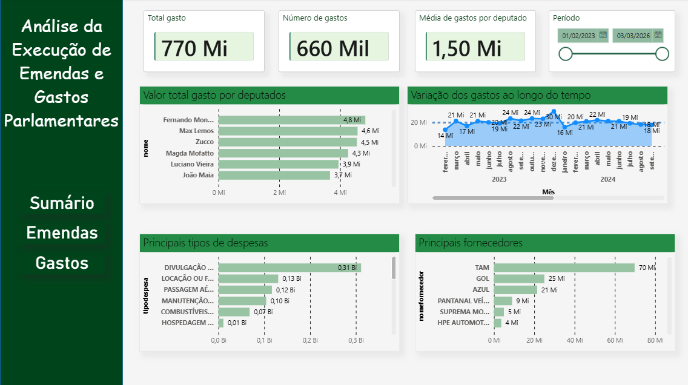

# 📊 Análise de Emendas Parlamentares e Gastos Públicos

Este projeto tem como objetivo analisar a destinação de recursos públicos através de emendas parlamentares e gastos relacionados, utilizando Power BI para criação de dashboards interativos.

---

## 🎯 Objetivo

Explorar como os recursos públicos estão sendo utilizados, respondendo perguntas como:

- Quanto foi empenhado vs pago?
- Quais áreas (funções) recebem mais recursos?
- Quais subfunções concentram maior investimento?
- Quem são os parlamentares com maiores gastos?
- Para onde está indo o dinheiro (fornecedores)?

---

## 🛠️ Ferramentas Utilizadas

- Power BI
- PostgreSQL
- DBeaver
- SQL

---

## 📊 Principais Análises

### 🔹 Emendas Parlamentares
- Total empenhado e total pago
- Percentual pago (% Pago)
- Distribuição por função (Saúde, Educação, etc.)
- Análise detalhada por subfunção
- Tipos de emenda (Individual, Bancada, Comissão)

### 🔹 Gastos (CEAP)
- Total de gastos
- Evolução ao longo do tempo
- Top parlamentares por gasto
- Gastos por partido
- Principais fornecedores

---

## 📈 Insights Relevantes

- A área da Saúde concentra a maior parte dos recursos (mais de 34 bilhões)
- Existe diferença significativa entre valores empenhados e pagos
- Gastos apresentam variação ao longo do tempo
- Determinados fornecedores concentram grande volume de despesas

---

## 🧠 Aprendizados

Durante o desenvolvimento deste projeto, foram aplicados conceitos como:

- Modelagem de dados
- Relacionamentos entre tabelas (1:N)
- Criação de medidas em DAX
- Tratamento de dados inconsistentes
- Construção de dashboards analíticos

---

## 📷 Dashboard

### Página Inicial

### Página de Emendas

### Página de Gastos

---

## ▶️ Como visualizar

1. Baixe o arquivo `.pbix`
2. Abra no Power BI Desktop
3. Navegue pelas páginas do relatório

---

## 📌 Observação

Os dados utilizados são públicos e foram tratados para fins de análise e estudo.

---

## 🚀 Autor

Projeto desenvolvido por [Seu Nome]
